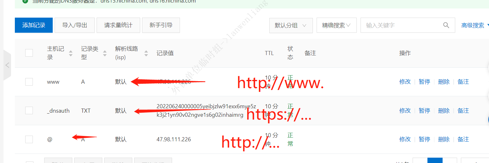
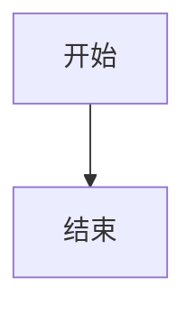

#markdown语法
##常用符号
+ 换行 <br> 111 <br>222
+ 

##一：标题语法
#一级标题

一级标题
===

##二级标题

二级标题

###三级标题
######六级标题

---

##二：分割线
- 第一种
***
- 第二种
---

##斜体和加粗
- 斜体
*斜体*
- 粗体
**粗体**

- 删除线
~~我是要删除的文字~~
  
- 斜体+粗体+删除
  ~~***又斜体又粗体***~~
---

##超链接和图片
###链接和图片的写法类似，图片仅在超链接前多了一个 ! ，一般是 [文字描述] (链接)
- 第一中写法超链接
[第一种写法超链接](https://www.baidu.com);

- 第二种写法  图片

---

##无序列表
###使用 -、+ 和 * 表示无序列表，前后留一行空白，可嵌套，例如  tab键增加一层
+ 一层 
  + 二层
      + 三层
         + 四层

- 一层
  - 二层
    - 三层
      - 四层

##有序列表
1. 一层11111 
    1. 层111111111
        2. 三层
2. 一层  
---

##文字引用
###使用 > 表示，可以有多个 >，表示层级更深，例如
> 1
>>2
> 
> 这样跳出去
>>>3 还可以更深
>>
>>这个去那里
>>>111 
> 
>跳出去
---

##8. 行内代码块
###使用 ` 表示，例如扩展：很多字符是需要转义，使用反斜杠 \ 进行转义
`这个是代码块................`
---

##代码块
###使用四个空格缩进表示代码块，一些 IDE 支持行数提示和着色，一般使用三个 ` 表示，例如
####三个```
```
public void test(){
  //各种代码
   ......
}

```
####四个空格
    public void test(){
    //各种代码
    ......
    }
---
##表格 
### -: 设置内容和标题栏居右对齐。<br> :- 设置内容和标题栏居左对齐。 <br> :-: 设置内容和标题栏居中对齐。<br> 使用<br>换行符实现换行。

| 名称 | 数量 | 价格 |
| ---- | :--- | ---: |
| 苹果 | 10 <br> 第二行 |11110.2|
|苹果| 1 |11.3|

---

##流程图
- 要的语法为 name=>type: describe，其中 type 主要有以下几种：
- 1.开始和结束：start end
- 2.输入输出：inputoutput
- 3.操作：operation
- 4.条件：condition
- 5.子程序：subroutine


###



```flow 
st=>start: Start:>http://www.google.com[blank]
e=>end:>http://www.google.com
op1=>operation: My Operation
sub1=>subroutine: My Subroutine
cond=>condition: Yes
or No?:>http://www.google.com
io=>inputoutput: catch something...
para=>parallel: parallel tasks

st->op1->cond
cond(yes)->io->e
cond(no)->para
para(path1, bottom)->sub1(right)->op1
para(path2, top)->op1

```
---
##12. 数学公式
使用 $ 表示，其中一个 $ 表示在行内，两个 $ 表示独占一行。

eg : $\sum_{i=1}^n a_i=0$

支持 LaTeX 编辑显示支持，访问 MathJax 参考更多使用方法。

推荐一个常用的数学公式在线编译网站：https://private.codecogs.com/latex/eqneditor.php

13.支持 HTML 标签

例如想要段落的缩进，可以如下：

不断行的空白格 或
半方大的空白 或
全方大的空白 或