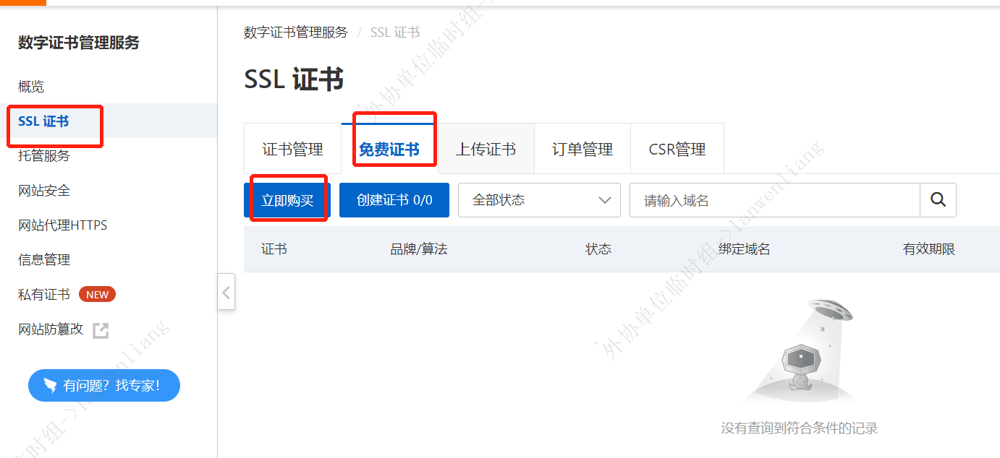
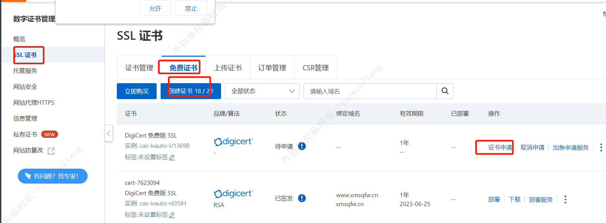
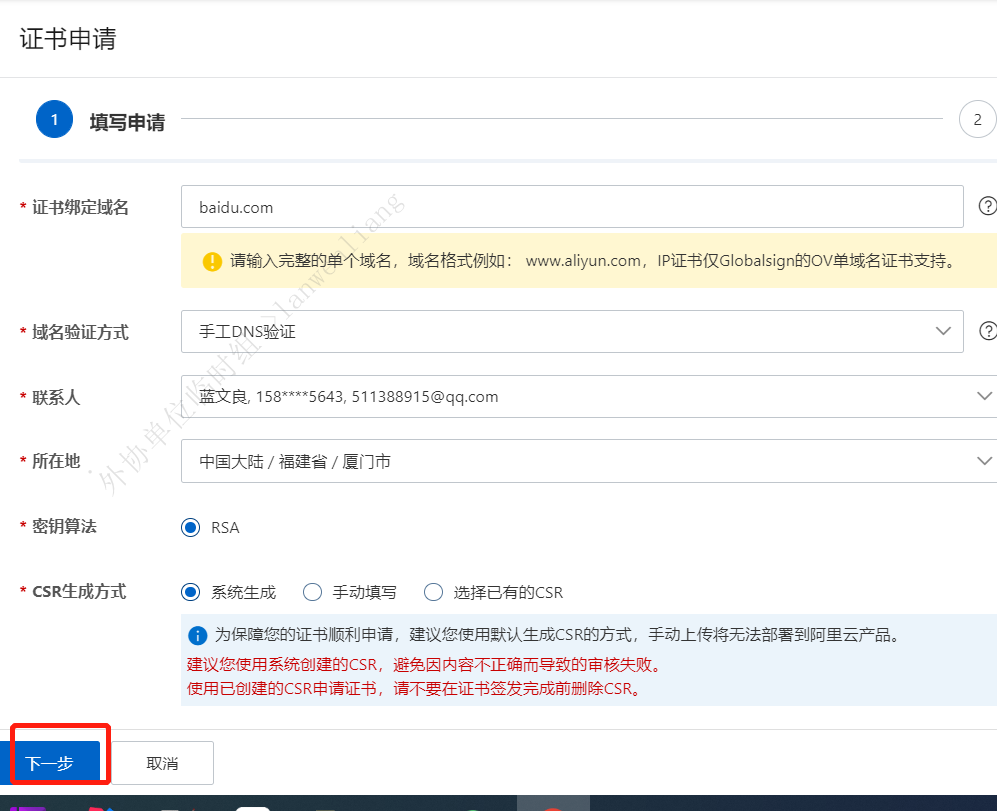
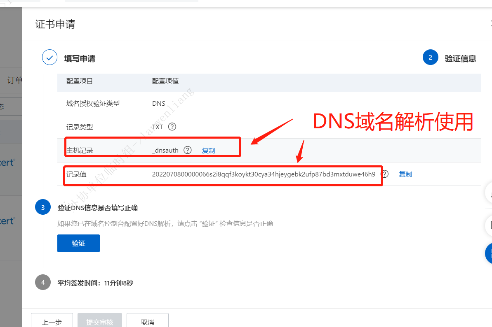
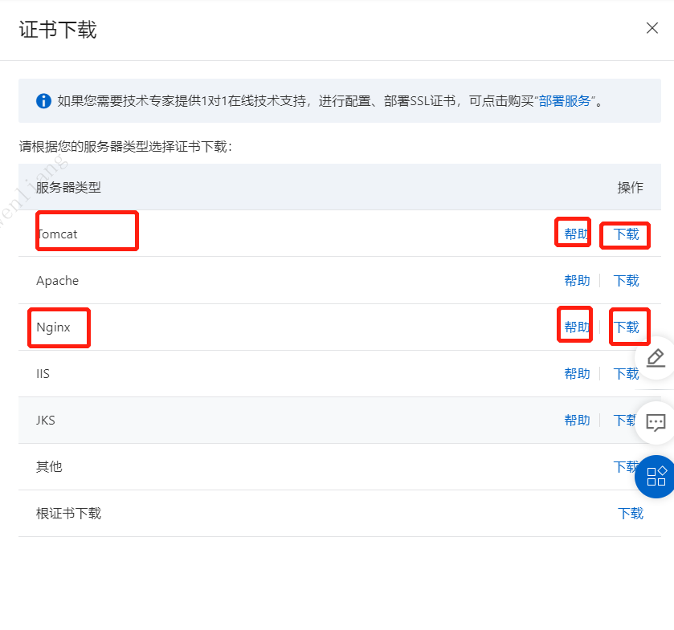

#https申请流程
- 可以找不同的地方进行申请SSL证书
- SSL 证书申请完成后。 配置正说，nginx 和 tomcat

##阿里申请SSL证书和 配置SSL证书

- 网址：https://yundunnext.console.aliyun.com/?spm=a2c1d.8251892.help.3.67ac5b76wN85TI&p=cas#/certExtend/free
    - 步骤一申请：
    - 步骤二创建SSL：
      
      
    - 步骤三等待审批（几十分钟）
    - 步骤四下载证书 nginx 和 tomcat
    
    - 步骤五部署证书:参考网址：https://help.aliyun.com/document_detail/138920.html  

