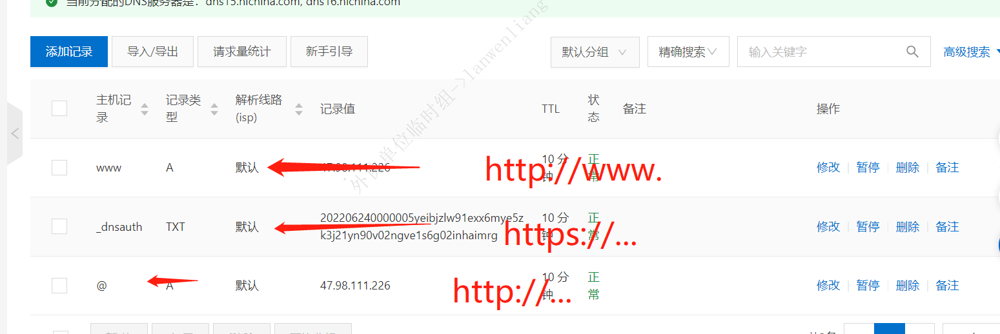

#域名申请流程
##一：购买服务器
选择对应的服务器供应商，选择对应的服务器进行购买
##二：网站备案
参考网址：https://beian.aliyun.com/?spm=5176.21103406.J_3207526240.11.6e3c1719to8mhD
注意事项：APP 申请，需要注意申请进度。服务器供应商先审批（1-3天），然后通管局备案审批（1周）
##三：购买域名
- 域名供应商：参考阿里
- 购买网址：https://wanwang.aliyun.com/domain/?spm=5176.13841030.0.0.11786fc4Y2RiEN

##四：DNS配置
- 公共DNS申请（免费）：
https://dns.console.aliyun.com/?spm=5176.12818093.products-recent.ddns.1b0d16d0s72h93#/pdns/dashboard
- 阿里DNS 域名解析网址：
https://dns.console.aliyun.com/?spm=5176.12818093.products-recent.ddns.1b0d16d0s72h93#/dns/domainList
- DNS配置：  

